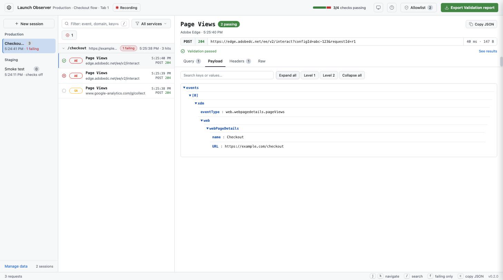
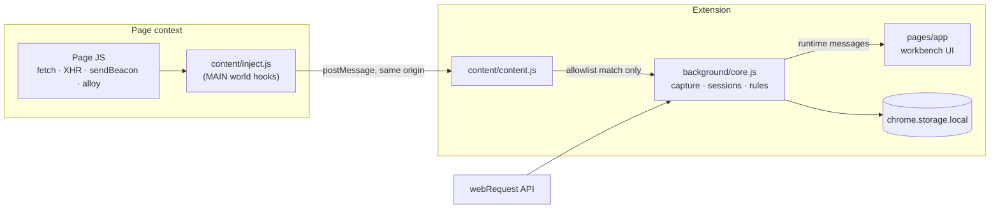

# Launch Observer

**A browser extension that captures analytics and marketing requests, decodes their payloads, and checks them against rules you define.**

Analytics bugs are hard to see: the request leaves the page, returns `204 No Content`, and the payload never appears in DevTools in a readable form. Launch Observer records those calls into named sessions, renders the payload as a searchable tree, and — optionally — validates every request against a JSON rulebook so a regression shows up as a red row instead of a missing metric three weeks later.



---

## Contents

- [Quick start](#quick-start)
- [How it works](#how-it-works)
- [Using the workbench](#using-the-workbench)
- [Validation rules](#validation-rules)
- [Service catalog](#service-catalog)
- [Development](#development)
- [Project layout](#project-layout)
- [Privacy and data](#privacy-and-data)
- [Browser differences](#browser-differences)

---

## Quick start

### Chrome / Edge

The compiled stylesheet is committed, so a fresh clone loads as-is — no build step needed.

1. Open `chrome://extensions`.
2. Enable **Developer mode**.
3. Click **Load unpacked** and select this repository's folder.
4. Click the toolbar icon to open the workbench window.

### Firefox

Firefox Stable needs the Manifest V2 build:

```bash
npm run build:firefox
```

1. Open `about:debugging#/runtime/this-firefox`.
2. Click **Load Temporary Add-on**.
3. Select `dist/firefox/manifest.json`.

### Record your first session

1. Open the page you want to test in a normal tab.
2. In the workbench, click **New session** — pick a site, name the session, and choose the tab to listen to. Locking to one tab keeps other tabs out of the recording.
3. Browse the page. Matching requests appear grouped by page navigation.
4. Select a request to read its headers, query parameters, and decoded payload.

Only requests whose domain matches the **allowlist** are captured. The default allowlist is a single entry, `edge.adobedc.net` (Adobe Edge); add more from the **Allowlist** dialog.

---

## How it works

Two independent capture paths feed one store. The `webRequest` path sees every matching request's metadata; the page-hook path recovers bodies the network layer cannot expose — most importantly Adobe WebSDK and `sendBeacon` calls that return `204` with no readable body.



Design points worth knowing:

- **One copy of the capture logic.** `background/core.js` holds all capture, session, and validation logic. `service-worker.js` (Chrome MV3) and `firefox-background.js` (Firefox MV2) are thin adapters that only supply what differs: MAIN-world injection and alarm scheduling. A test (`tests/firefox-uat-resolve.test.js`) enforces that the Firefox entry never grows its own copy of `lib/`.
- **Nothing leaves the page unless you asked for it.** The injected hook publishes a payload only when the request URL matches your allowlist, and messages are accepted only from the page's own origin.
- **Hooks are opt-in and self-removing.** Page hooks install only while **Enable payload capture via page hooks** is on and a session is active. Everywhere else the injected script removes its `fetch`/`XHR`/`sendBeacon` wrappers as soon as settings arrive.
- **Writes are debounced.** A single navigation can fire hundreds of events; storage writes are coalesced (500 ms, 2 s maximum delay) rather than rewriting the whole request list per event. If a write still exceeds quota, the oldest half is dropped and the UI is notified.

### Defaults

| Setting | Default | Notes |
| --- | --- | --- |
| `allowlist` | `["edge.adobedc.net"]` | Matches the exact domain or any subdomain |
| `maxEntries` | `2000` | Oldest requests are trimmed past this cap |
| `enableHooks` | `false` | Page hooks are opt-in |
| `debugHooks` | `false` | Verbose hook logging |
| Idle prompt | 5 minutes | A session with no captured requests prompts to end |

---

## Using the workbench

The toolbar icon opens the workbench in its own window, so it can sit beside the page under test. Closing it ends the active session.

| Key | Action |
| --- | --- |
| `j` / `k` | Move through the request list (arrow keys work too) |
| `/` | Jump to the filter box |
| `f` | Show only requests with a failing check |
| `c` | Copy the selected request's payload as JSON |
| `Esc` | Close a menu, or leave the filter box |

Other things the UI does that are easy to miss:

- **Payload search** expands matching branches automatically. Hover a row for **Copy value** and **Copy path** — the copied path uses the same syntax validation rules use.
- **Export validation report** produces a printable (PDF-ready) summary of every check in the session.
- **Manage data** shows local storage usage and clears sessions or everything.
- The theme icon cycles system → light → dark, remembered per machine.

---

## Validation rules

Validation rules are an optional JSON file — one per site — describing checks to run against each captured request. Import them from the **Validation rules** dialog, then enable **Run validations** when starting a session. Results appear inline on each request and in the exported report.

> **Naming note:** the UI calls these *validation rules*. The file format and the source tree still use the original `uat` / `assertions` vocabulary (`lib/uat/`, the `assertions` array). Both refer to the same thing.

Start from **Validation rules → Download template**, which emits a file exercising every operator. Files are validated on import: unknown operators, unknown sources, bad regexes, duplicate ids, and malformed ranges are reported with the rule number rather than silently failing every request later.

### A minimal example

```json
{
  "siteId": "acme-www",
  "siteName": "Acme Storefront",
  "assertions": [
    {
      "id": "page-name-present",
      "title": "Page name is present",
      "validations": [
        {
          "source": "payload",
          "path": "events[0]._experience.analytics.customDimensions.eVars.eVar41",
          "operator": "exists"
        }
      ]
    },
    {
      "id": "pageview-once",
      "title": "Pageview fires exactly once",
      "scope": "page",
      "count": "exactly",
      "value": 1,
      "validations": [
        {
          "source": "payload",
          "path": "events[0].xdm.eventType",
          "operator": "equals",
          "expected": "web.webpagedetails.pageViews"
        }
      ]
    }
  ]
}
```

### Conditions vs. validations

This is the distinction that makes the whole format click:

- **`conditions`** decide whether a rule *applies* to a request. If they do not match, the rule is reported as **skipped**, not failed.
- **`validations`** decide whether an applicable request **passes** or **fails**. They always use `all` logic — every validation must pass. There is no override.

So "on checkout pages, the purchase event must carry a revenue value" is a condition (checkout page) plus a validation (revenue exists).

### Top-level fields

| Field | Type | Required | Description |
| --- | --- | --- | --- |
| `siteId` | string | ✅ | Identifier for the site |
| `siteName` | string | — | Human-friendly label shown in the UI |
| `global` | object | — | Gates applied before any rule runs |
| `assertions` | array | ✅ | The rules themselves |

**`global`** narrows what the whole file applies to:

| Field | Type | Behavior |
| --- | --- | --- |
| `includeServices` | string[] | Request's service must be one of these |
| `excludeServices` | string[] | Skip requests from these services |
| `includeConditions` | condition[] | **All** must pass, or the file is skipped |
| `excludeConditions` | condition[] | If **any** matches, the file is skipped |

### Assertion fields

| Field | Type | Required | Default | Description |
| --- | --- | --- | --- | --- |
| `id` | string | ✅ | — | Unique within the file |
| `title` | string | — | — | Shown in the UI |
| `description` | string | — | — | Shown in the UI |
| `scope` | `request` \| `page` | — | `request` | Per-request check, or a count across the page navigation |
| `conditions` | condition[] | — | `[]` | Applicability — see above |
| `conditionsLogic` | `all` \| `any` | — | `all` | How `conditions` combine |
| `validations` | condition[] | ✅ | — | Pass/fail checks, always `all` logic |
| `count` | `exactly` \| `at_least` \| `at_most` | page scope only | — | Count comparison |
| `value` | number | page scope only | — | Expected count |

Page-scope rules count matching requests within the same page navigation (keyed by page URL plus navigation id), which is how "fires exactly once" is expressed.

### Condition fields

| Field | Type | Required | Default |
| --- | --- | --- | --- |
| `source` | `payload` \| `query` \| `headers` \| `raw` | — | `payload` |
| `path` | string | ✅ unless `source: raw` | — |
| `operator` | see below | ✅ | — |
| `expected` | string \| number \| array | for comparison operators | — |

**How `path` is read per source:**

| Source | `path` means |
| --- | --- |
| `payload` | Dotted/bracket path into the decoded body — `events[0].xdm.eventType` |
| `query` | An exact query parameter name |
| `headers` | A request header name, matched case-insensitively |
| `raw` | Not used; the whole raw body is the value |

Payload bodies are decoded as JSON first, then as URL-encoded form pairs. Path traversal never walks the prototype chain (`__proto__`, `constructor`, and `prototype` always resolve to nothing).

### Operators

| Operator | `expected` | Passes when |
| --- | --- | --- |
| `exists` | — | A non-empty value is present |
| `not_exists` | — | No non-empty value is present |
| `equals` | string \| number | String-equal |
| `contains` | string | Substring match |
| `starts_with` | string | Prefix match |
| `ends_with` | string | Suffix match |
| `regex` | string | Pattern matches |
| `in` | array | Value is in the list |
| `not_in` | array | Value is in none of the list |
| `gt` / `gte` | number | Greater than / or equal |
| `lt` / `lte` | number | Less than / or equal |
| `range` | `[min, max]` | Inclusive numeric range |

**Multi-value paths:** a path may resolve to several values (an array in the payload, a repeated query parameter). Every operator except `not_in` passes if **any** value matches; `not_in` requires **all** values to be absent from the list.

Regex patterns from imported files are bounded — pattern source is capped at 1000 characters and the tested subject at 10,000 — so a catastrophically backtracking pattern cannot hang the background script.

---

## Service catalog

Captured domains are resolved to a known service for badges, filtering, and `includeServices` / `excludeServices` gates. Custom domains can be mapped to any of these IDs (or to a custom name) from the allowlist dialog.

| Analytics | Advertising | CDP |
| --- | --- | --- |
| `adobe-edge` — Adobe Edge | `google-ads` — Google Ads | `segment` — Segment |
| `adobe-analytics` — Adobe Analytics | `meta` — Meta Pixel | |
| `google-analytics` — Google Analytics | `tiktok` — TikTok Pixel | |
| `baidu` — Baidu Tongji | `linkedin` — LinkedIn Insight | |
| `hotjar` — Hotjar | `pinterest` — Pinterest Tag | |
| `mixpanel` — Mixpanel | `snapchat` — Snapchat Pixel | |
| `amplitude` — Amplitude | `x` — X Ads | |
| | `microsoft-ads` — Microsoft Ads (Bing) | |
| | `demandbase` — Demandbase | |

---

## Development

Requires Node 20+ (CI builds on 20; the test runner needs 18+).

```bash
npm install
```

| Command | What it does |
| --- | --- |
| `npm test` | Runs the jsdom + unit suite (`node --test`) |
| `npm run build:css` | Compiles Tailwind into `styles/app.css` |
| `npm run preview` | Serves the real UI in a normal browser |
| `npm run build:chrome` | `dist/chrome/` and `dist/chrome.zip` |
| `npm run build:firefox` | `dist/firefox/` and `dist/firefox.zip` |
| `npm run build:all` | Both packages |

Build scripts stage only the files each browser loads, so published packages never pick up tests, docs, the Tailwind source, or the other platform's entry points.

### Preview harness

```bash
npm run build:css
npm run preview             # http://127.0.0.1:8731/pages/app.html
npm run preview -- 9000     # a different port
```

This serves the real `pages/app.html` with the extension APIs faked, so the workbench can be driven in a browser without loading the extension. It reads straight from the working tree — edit `pages/`, `styles/`, or `lib/` and reload (re-run `build:css` after changing Tailwind classes).

The fixture is `sampleState()` from `tests/helpers/sample-state.js`, the same one the jsdom tests use, so the two cannot disagree. In the page console:

- `__loStub.reset()` — clears persisted flags and replays the first-run tour
- `__errs` — lists anything the page threw

Use the harness for what jsdom cannot judge: real layout at real widths, contrast in both themes, and whether transitions actually move. The tests pass on markup that renders wrong — an inert `flex`, a palette token matching the surface behind it, a `peer-*` variant that reaches nothing — and only a browser shows it.

Loading the unpacked extension remains the only way to exercise live capture and the page hooks.

### Debugging page hooks

From the extension page console:

```js
LaunchObserverDebug.enableHookLogging(true)
LaunchObserverDebug.disableHookLogging()
LaunchObserverDebug.isHookLoggingEnabled()
```

---

## Project layout

```
background/
  core.js                 all capture, session, and validation logic (shared)
  service-worker.js       Chrome/Edge MV3 entry — MAIN-world injection, alarms
  firefox-background.js   Firefox MV2 entry, loaded from firefox-background.html
content/
  content.js              bridge between page and extension
  inject.js               MAIN-world fetch/XHR/sendBeacon/alloy hooks
lib/
  parse.js                payload and query-string decoding
  services.js             service catalog and domain resolution
  uat/
    schema.js             rule-file validation and the downloadable template
    resolve.js            path resolution and page-scope counting
    evaluate.js           operators and rule evaluation
pages/
  app.html                the workbench
  app/
    main.js               wiring, event listeners, runtime messages
    state.js              shared state and DOM refs
    workbench.js          header readouts, filters, theme, keyboard nav
    requests.js           request list and details
    sessions.js           sessions sidebar
    payload.js            JSON tree rendering and parsing helpers
    allowlist.js          allowlist and services UI
    uat.js                validation rules UI and report export
    tour.js               first-run tour
    ui.js                 tabs, sidebar, toasts
    utils.js              formatting helpers
scripts/                  build and preview scripts
tests/                    node --test suites (jsdom for UI)
docs/                     GitHub Pages site (index.html, privacy.html, uat.html)
```

The UI entry point is `pages/app/main.js`, loaded as an ES module.

---

## Privacy and data

- Everything stays in this browser's local extension storage (`chrome.storage.local`). Nothing is uploaded, and the extension makes no network requests of its own.
- Captured payloads are handed from the page to the extension **only** when the request URL matches the allowlist. Nothing else leaves the page context.
- The extension observes only. It never modifies, blocks, or replays a request; validation rules classify what was already sent.
- Use **Manage data** in the sidebar to review storage usage or clear it.

---

## Browser differences

The Chrome/Edge build is the most capable and is the recommended target, especially for Adobe WebSDK.

| | Chrome / Edge | Firefox |
| --- | --- | --- |
| Manifest | V3 | V2 |
| MAIN-world injection | ✅ `scripting.executeScript` | ❌ not supported |
| WebSDK / `sendBeacon` bodies | Reliable | Best-effort |

On Firefox, sites with a strict CSP can block hook injection, which may prevent capturing `sendBeacon` and `204` payload bodies.

To publish to AMO, set a permanent add-on ID in `manifest.firefox.json` under `browser_specific_settings.gecko.id`, and upload `dist/firefox.zip` (its manifest sits at the zip root).

---

## Documentation site

The GitHub Pages site lives in `docs/`, with the landing page at `docs/index.html` and the privacy policy at `docs/privacy.html`.
